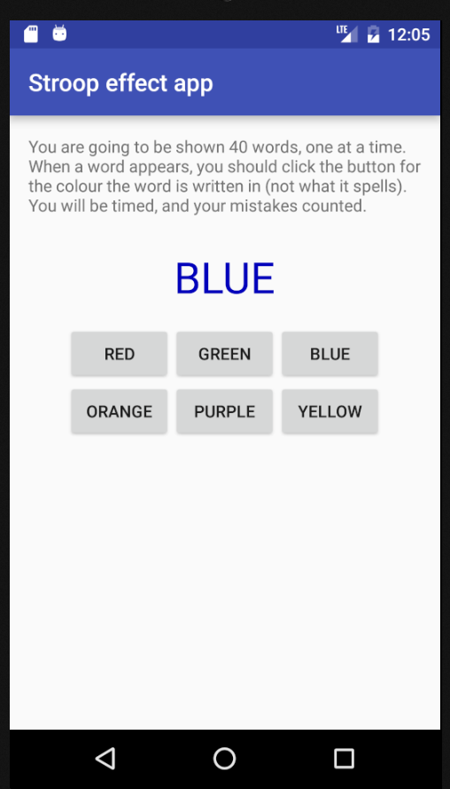

# A simple sample Android app

This is a very simple Android app, written in one evening, so that students in COSC370/COSC570 can
see if they can get Android Studio installed and running before class starts.

There are, of course, plenty of sample apps around, but it's useful to have our own little themed
one, because then we can also use it in class to show how some basic parts of Android apps work.

Over the next few days we'll put a few [set-up instructions](https://unecosc370.github.io/sampleAndroidApp-site/)
up, but they're not finished yet.

The app itself is loosely based on the Stroop effect (but clicking buttons for the colours rather
than saying them aloud).

